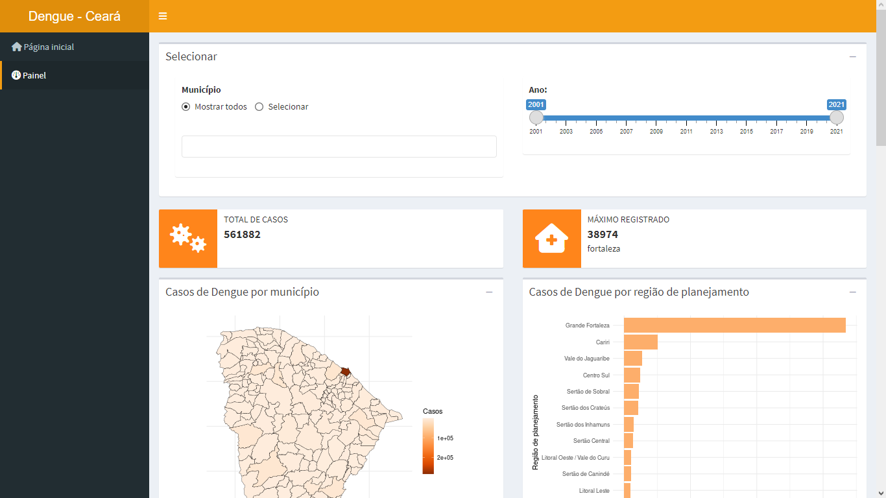

# dengue-ce

O Painel Casos de Dengue no Ceará é uma aplicação Shiny para visualização de dados de casos de Dengue no estado do Ceará, Brasil. O conjunto de dados é da Secretaria da Saúde (SESA) do estado do Ceará, obtido através do portal [IPECEDATA](http://ipecedata.ipece.ce.gov.br/).

## Link

- Shinyapps: [https://rubensocj.shinyapps.io/dengue-ce/](https://rubensocj.shinyapps.io/dengue-ce/)
